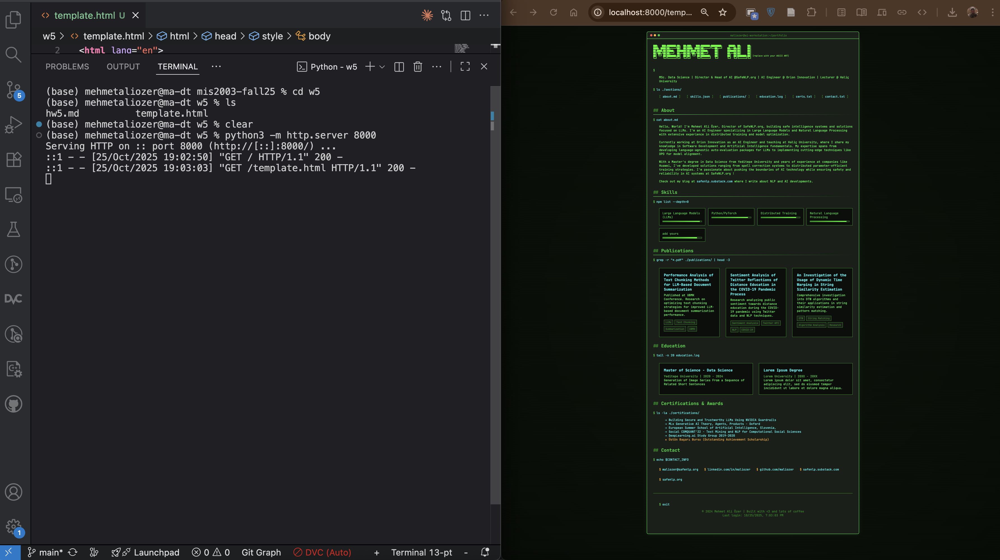

# Homework 5: Personal Web Page

In this homework, you will create your own personal web page by forking a repository and customizing a template.

## Instructions

1. **Fork the Repository**
   - Go to https://github.com/maliozer/mis2003-fall25
   - Click the "Fork" button in the top-right corner
   - This will create a copy of the repository in your GitHub account

2. **Clone Your Fork**
   - Open your forked repository on GitHub
   - Click the green "Code" button and copy the HTTPS URL
   - Clone the repository to your local machine using:
     ```
     git clone [your-fork-url]
     ```

3. **Create Your Personal Web Page**
   - Navigate to the web page template directory `w5/template.html`
   - Make a copy of `template.html` and rename it to `yourname_yoursurname.html`
     (Example: `john_doe.html`)
   - Edit your HTML file with your personal information:
     - Update your name and title
     - Add your own photo
     - Modify the content sections
     - Update social media links
     - Customize colors and styling if desired

   <!-- Added local preview instructions -->
   3.a **Local preview (optional, recommended)**
   - Open a terminal and change directory to the `w5` folder:
     ```
     cd /Users/mehmetaliozer/Documents/GitHub/mis2003-fall25/w5
     ```
   - Start a simple static server:
     ```
     python3 -m http.server 8000
     ```
   - Open your browser and go to:
     ```
     http://localhost:8000
     ```
     then click your `firstname_lastname.html` file to view a live preview.

   <!-- Example preview screenshot -->
   ### Hot-reload preview on localhost
   The image below shows an example browser preview. 
    
    On the left, run the local server with:
   ```
   python3 -m http.server 8000
   ```
   On the right, open your browser to:
   ```
   http://localhost:8000
   ```
   to view a live preview of your changes. Complete your profile page, verify it in the preview, and when you are satisfied commit and push your changes.

4. **Submit Your Changes**
   - Add your new file:
     ```
     git add yourname_yoursurname.html
     ```
   - Commit your changes:
     ```
     git commit -m "Add personal web page for [Your Name]"
     ```
   - Push to your fork:
     ```
     git push origin main
     ```

5. **Create Pull Request**
   - Go to your fork on GitHub
   - Click "Pull Request"
   - Click "New Pull Request"
   - Ensure the base repository is `maliozer/mis2003-fall25`
   - Add a descriptive title and description
   - Submit the pull request
   - **Copy the pull request URL**

6. **Submit on HalicX Platform**
   - Create a new Word document
   - Paste your pull request URL into the document
   - Save the document as PDF format (File > Save As > PDF)
   - Upload the PDF file to HalicX platform under HW5 assignment

## Submission Requirements
- Your file must be named `firstname_lastname.html`
- Must include your personal information
- All links and images should work correctly
- Code should be properly formatted and valid HTML

